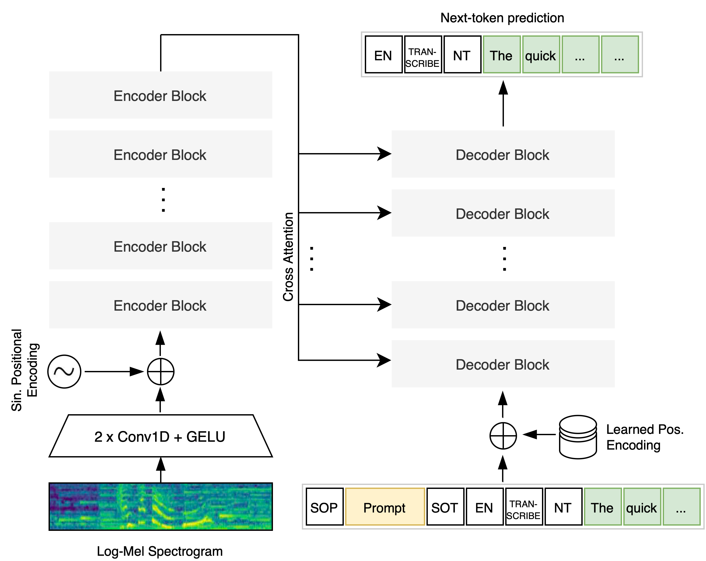
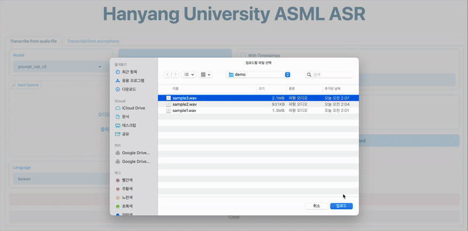

<div align="center"><h1>&nbsp;Far-Field Automatic Speech Recognition(ASR)</h1></div>

This repository contains code for a far-field speech recognition demo based on the Whisper model.

## Introduction

We provide far-field environmental information as prompts to improve speech recognition performance.

<div align="center">
  <picture>
  
  </picture>
  <br>
  <div align="center" width="80%">
  <em>An illustration of how to provide prompts for Whisper model.</em>
  </div>
  <br>
</div>

If you're interested in training the prompt-based Whisper model, check out [this GitHub](https://github.com/Jieun1018/prompt-whisper-2.git).

Check out the examples/sample_audio folder for the sample audio featured in the gif below. The audio file was recorded from 10 meters away.

<div align="center">
  <picture>
  
  </picture>
  <br>
  <div align="center" width="80%">
  <em>Far-field ASR model result(w/ Audio file recorded from 10 meters away).</em>
  </div>
  <br>
</div>

## Contents
- [Introduction](#Introduction)
- [Contents](#contents)
- [Installation](#installation)
- [Preparation](#preparation)
  - [Prepare faster-whisper models](#prepare-faster-whisper-models)
- [Run](#run)
  - [Run asr server](#run-asr-server)
  - [Run gradio server](#run-gradio-server)

## Installation
```bash
cd /path/to/gradio_asr/tools
bash install_virtualenv.sh
bash install_whisper_modules.sh
bash install_modules.sh
```

## Preparation
### Prepare faster-whisper models
In convert_whisper_to_faster.sh \
Set --model to whisper model saved directory \
Set --output_dir to the desired output directory
```bash
cd /path/to/gradio_asr
bash convert_whisper_to_faster.sh
mkdir -p models
cp -r /path/to/output_dir models/
```

## Run
### Run asr server
In the remote server to run ASR transcription,
```bash
cd /path/to/gradio_asr
. tools/activate_python.sh
python asr_server.py
```

### Run gradio server
In the remote server to run Gradio demo,
```bash
cd /path/to/gradio_asr
. tools/activate_python.sh
python gradio_server.py
```
